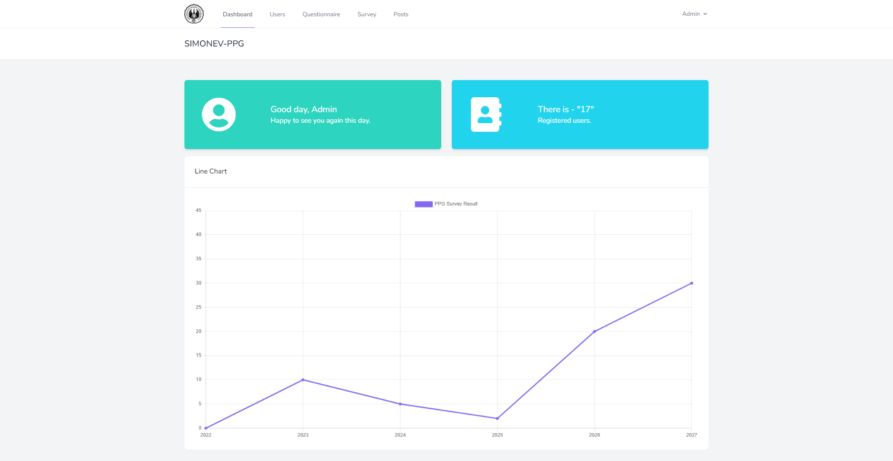

# SIMONEV-PPG

Web application for monitoring and as evaluation system created using Laravel framework.

## License

The Laravel framework is open-sourced software licensed under the [MIT license](https://opensource.org/licenses/MIT).
